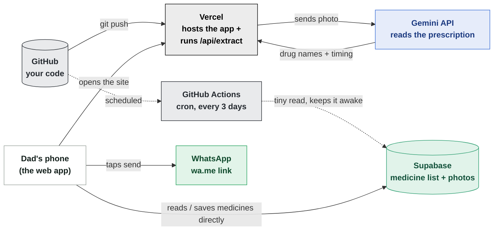

# أدويتي — Drug Organizer

Arabic mobile web app to photograph a prescription, auto-extract the drug list, review/edit
name & quantity per drug, attach a photo per drug, and send a ready-made Arabic summary
to a pharmacy over WhatsApp (via a pre-filled `wa.me` link).

Built entirely on free tiers: Next.js on Vercel, Supabase (Postgres + Storage), Google
Gemini API for image extraction, WhatsApp `wa.me` links (no paid Business API).

## How the pieces fit together

Three free services, each doing exactly one job. Solid arrows happen every time the app
is used; dotted arrows only fire when code is pushed, or every few days in the background.



**GitHub** — stores the code and its history. Nothing runs here; it's the filing cabinet.
Every push to `main` is the signal that tells Vercel to build a new version.

**Vercel** — builds the Next.js app and serves it to any browser at the live URL. It's
also the only place `/api/extract` runs, since that route holds the Gemini key and must
never expose it to the browser.

**Supabase** — a Postgres database (the `medicines` and `scans` tables) plus file storage
for prescription/pill photos. The browser talks to it *directly* for reading and saving
the list — no need to round-trip through Vercel for that.

**Gemini API** — reads the prescription photo and returns a structured guess at drug
name, dosage, and timing. Called once per scan, only from inside Vercel's server code.

**WhatsApp** — not really "integrated": the app just builds a `wa.me` link with the
message pre-typed. Tapping it opens the phone's own WhatsApp app; the user still presses
send themselves.

**GitHub Actions** — a free scheduled job living in this repo. Every 3 days it sends one
tiny read request to Supabase, purely so the free project never sees 7 idle days and
auto-pauses (see note at the bottom of this file).

### One scan, step by step

1. **Dad → Vercel** — opens the app, taps "إضافة من صورة روشتة". Vercel serves the page;
   Supabase and Gemini aren't involved yet.
2. **Browser** — photographs the prescription; the photo is compressed on-device before
   anything is sent anywhere.
3. **Browser → Vercel → Gemini** — the compressed photo is posted to `/api/extract`,
   which forwards it to Gemini with the extraction prompt.
4. **Gemini → Vercel → Browser** — a structured drug list comes back and is passed
   straight through to the browser.
5. **Browser** — he reviews and edits the list on-screen; nothing is saved yet.
6. **Browser → Supabase** — taps "حفظ في القائمة"; the confirmed rows are written
   straight into the `medicines` table.
7. **Browser → WhatsApp** — taps "إرسال إلى الصيدلية"; the app opens WhatsApp with the
   Arabic message pre-typed.

### Free-tier headroom

| Service | Free ceiling | Actual use here |
|---|---|---|
| Supabase database | 500 MB | A few KB per medicine row |
| Supabase storage | 1 GB | A handful of compressed photos |
| Supabase bandwidth | 5 GB / month | A few page loads a month |
| Vercel function time | 60 sec / request (Hobby cap) | Gemini call usually finishes in 2–10 sec |
| GitHub Actions (public repo) | unlimited minutes | ~1 minute, every 3 days |

## One-time setup (outside of code)

1. **Gemini API key** — go to [Google AI Studio](https://aistudio.google.com), sign in,
   create a free API key (no credit card required).
2. **Supabase project** — create a free project at [supabase.com](https://supabase.com):
   - Settings → API: copy the Project URL and the `anon public` key.
   - SQL Editor: paste and run `supabase/schema.sql`.
   - Storage: create a **public** bucket named `drug-photos`.
3. **Pharmacy WhatsApp number** — full international format, no `+` and no leading zero
   (e.g. `20xxxxxxxxxx` for an Egyptian number).
4. Copy `.env.local.example` to `.env.local` and fill in the four values:
   ```
   GEMINI_API_KEY=
   NEXT_PUBLIC_SUPABASE_URL=
   NEXT_PUBLIC_SUPABASE_ANON_KEY=
   NEXT_PUBLIC_PHARMACY_WHATSAPP_NUMBER=
   ```

## Run locally

```bash
npm install
npm run dev
```

Open [http://localhost:3000](http://localhost:3000).

## Deploy (free)

Push to a GitHub repo, import it into [Vercel](https://vercel.com) (free Hobby plan),
and add the same four environment variables in Project Settings → Environment Variables.

Note: a Supabase free-tier project auto-pauses after ~7 days with no activity — if the
app stops loading after a quiet week, just open the Supabase dashboard and restore it
(one click).
