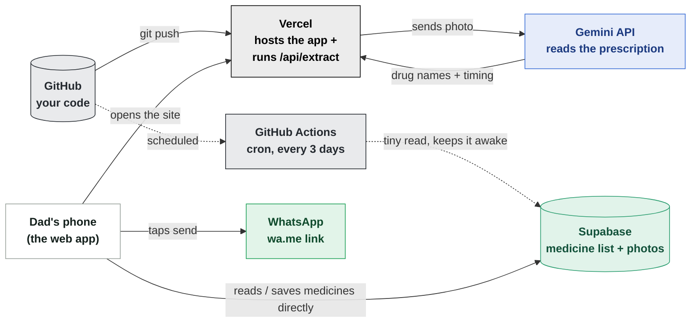

# أدويتي — Drug Organizer

Arabic mobile web app to photograph a prescription, auto-extract the drug list, review/edit
name & quantity per drug, attach a photo per drug, and send a ready-made Arabic summary
to a pharmacy over WhatsApp (via a pre-filled `wa.me` link).

Built entirely on free tiers: Next.js on Vercel, Supabase (Postgres + Storage), Google
Gemini API for image extraction, WhatsApp `wa.me` links (no paid Business API).

## How the pieces fit together

Three free services, each doing exactly one job. Solid arrows happen every time the app
is used; dotted arrows only fire when code is pushed, or every few days in the background.



**GitHub** — stores the code and its history. Nothing runs here; it's the filing cabinet.
Every push to `main` is the signal that tells Vercel to build a new version.

**Vercel** — builds the Next.js app and serves it to any browser at the live URL. It's
also the only place `/api/extract` runs, since that route holds the Gemini key and must
never expose it to the browser.

**Supabase** — a Postgres database (the `medicines` and `scans` tables) plus file storage
for prescription/pill photos. The browser talks to it *directly* for reading and saving
the list — no need to round-trip through Vercel for that.

**Gemini API** — reads the prescription photo and returns a structured guess at drug
name, dosage, and timing. Called once per scan, only from inside Vercel's server code.

**WhatsApp** — not really "integrated": the app just builds a `wa.me` link with the
message pre-typed. Tapping it opens the phone's own WhatsApp app; the user still presses
send themselves.

**GitHub Actions** — a free scheduled job living in this repo. Every 3 days it sends one
tiny read request to Supabase, purely so the free project never sees 7 idle days and
auto-pauses (see note at the bottom of this file).

### One scan, step by step

1. **Dad → Vercel** — opens the app, taps "إضافة من صورة روشتة". Vercel serves the page;
   Supabase and Gemini aren't involved yet.
2. **Browser** — photographs the prescription; the photo is compressed on-device before
   anything is sent anywhere.
3. **Browser → Vercel → Gemini** — the compressed photo is posted to `/api/extract`,
   which forwards it to Gemini with the extraction prompt. Handwriting is often
   misread at this stage — that's expected, it gets corrected next.
4. **Browser → Vercel → Supabase** — each extracted name is posted to
   `/api/match-names`, which runs a fuzzy (trigram) search per name against the
   `drug_reference` table — all local Postgres queries in parallel, no external
   calls, done in a fraction of a second.
5. **Browser → Vercel → Gemini** — the original names plus their candidate
   matches go to `/api/reconcile`, a second (text-only, no image) Gemini call
   that decides per item: swap in a candidate's real registry name, or keep the
   original if none of the candidates actually match.
6. **Browser** — he reviews and edits the corrected list on-screen (rows matched
   against the registry get a green "✓" mark); nothing is saved yet.
7. **Browser → Supabase** — taps "حفظ في القائمة"; the confirmed rows are written
   straight into the `medicines` table.
8. **Browser → WhatsApp** — taps "إرسال إلى الصيدلية"; the app opens WhatsApp with the
   Arabic message pre-typed.

Steps 4–5 are each their own short-lived API call rather than one long request —
each Vercel Hobby function gets its own fresh 60-second budget, and if either
step fails outright, the flow just falls back to the raw extraction from step 3
instead of blocking the user.

### Accounts, friends, and sharing

Every family member has their own account and their own private medicine list —
nothing here is a single shared list anymore. Login is a first name + a numeric
PIN (4+ digits), not email or WhatsApp OTP (the latter is a real per-message
cost with Meta, not a free option — see below).

Under the hood each family member is a real Supabase Auth user, created once by
`scripts/provision-family.mjs` (a synthetic `@drugorginizer.local` email + the
PIN as the password — Supabase's own password hashing stores it, this app never
touches or sees the PIN itself again after creation). The login screen never
reads the accounts table directly: typing a name calls `resolve_login_email()`,
a database function that returns *only* the matching email (or nothing), then
the browser signs in with that email + the typed PIN via Supabase Auth directly
— no server-side login route needed.

Every row in `medicines`/`scans` carries an `owner_id`, and Postgres Row Level
Security enforces `owner_id = auth.uid()` on every read/write/delete — so this
isn't a UI-level restriction, it's enforced at the database no matter what
request makes it there.

**Friends**: adding someone by their invite code (`/friends`) connects both
directions at once via `add_friend()`, so the other person never has to
separately add you back. **Sharing**: sending your list to a friend inserts
rows into a `shared_items` queue — nothing touches their real list until they
tap accept (one at a time, or "قبول الكل" to accept everything at once), which
runs through one atomic `accept_shares()` function either way.

See [`docs/AUTH_ARCHITECTURE.md`](docs/AUTH_ARCHITECTURE.md) for a full
file-by-file breakdown and the event-by-event flow.

### Free-tier headroom

| Service | Free ceiling | Actual use here |
|---|---|---|
| Supabase database | 500 MB | A few KB per medicine row |
| Supabase storage | 1 GB | A handful of compressed photos |
| Supabase bandwidth | 5 GB / month | A few page loads a month |
| Vercel function time | 60 sec / request (Hobby cap) | Gemini call usually finishes in 2–10 sec |
| GitHub Actions (public repo) | unlimited minutes | ~1 minute, every 3 days |

## One-time setup (outside of code)

1. **Gemini API key** — go to [Google AI Studio](https://aistudio.google.com), sign in,
   create a free API key (no credit card required).
2. **Supabase project** — create a free project at [supabase.com](https://supabase.com):
   - Settings → API: copy the Project URL and the `anon public` key.
   - SQL Editor: paste and run `supabase/schema.sql` (this also creates the
     `drug-photos` bucket and the `drug_reference` table/function — no need
     to click through the dashboard for the bucket separately).
   - Table Editor → `drug_reference` → **Import data via spreadsheet** →
     upload `data/egyptian-drugs.csv` from
     [karem505/egyptian-drug-database](https://github.com/karem505/egyptian-drug-database)
     (CC0, ~25k Egyptian-market drugs incl. imported brands). This seeds the
     reference data used to correct AI misreads of handwritten prescriptions.
3. **Pharmacy WhatsApp number** — full international format, no `+` and no leading zero
   (e.g. `20xxxxxxxxxx` for an Egyptian number).
4. **Accounts** — in the Supabase dashboard, go to Authentication → Sign In /
   Providers → **Email**, and check "Minimum password length" is 4 or lower
   and "Password Requirements" has no letter/symbol requirement, so plain
   numeric PINs are accepted. ("Leaked Password Protection" is a Pro-plan-only
   feature — it won't even appear on the free tier, so there's nothing to
   disable there.) Then, edit the `FAMILY_MEMBERS` list at the top of
   `scripts/provision-family.mjs` and run it once locally:
   ```bash
   SUPABASE_URL=https://xxxx.supabase.co \
   SUPABASE_SERVICE_ROLE_KEY=xxxx \
   node scripts/provision-family.mjs
   ```
   The service role key (Settings → API → `service_role`) is only ever used in
   this one local command — never commit it, never add it to Vercel. Re-run
   the script any time to add one more family member later.
5. Copy `.env.local.example` to `.env.local` and fill in the four values:
   ```
   GEMINI_API_KEY=
   NEXT_PUBLIC_SUPABASE_URL=
   NEXT_PUBLIC_SUPABASE_ANON_KEY=
   NEXT_PUBLIC_PHARMACY_WHATSAPP_NUMBER=
   ```

## Run locally

```bash
npm install
npm run dev
```

Open [http://localhost:3000](http://localhost:3000).

## Deploy (free)

Push to a GitHub repo, import it into [Vercel](https://vercel.com) (free Hobby plan),
and add the same four environment variables in Project Settings → Environment Variables.

Note: a Supabase free-tier project auto-pauses after ~7 days with no activity — if the
app stops loading after a quiet week, just open the Supabase dashboard and restore it
(one click).
